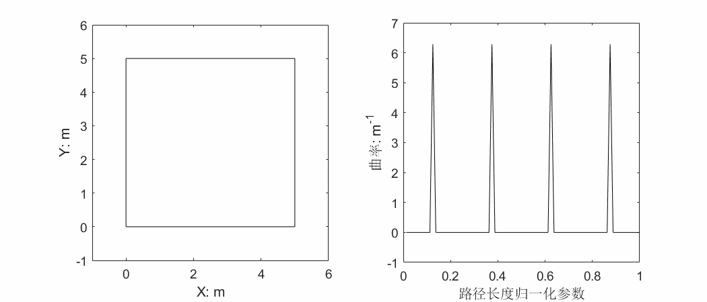

# CurvatureSmoothingBasedOnEnergyFunction

### This is a demo to show the method used for path curvature smoothing for intelligent vehicles.You can check the details from paper Research on path curvature smoothing method based on energy function for intelligent vehicles(基于能量函数的智能车辆路径曲率平滑方法研究) on Chinese Journal of Intelligent Science and Technology(智能科学与技术学报).

### How to use this demo

On Matlab:

```matlab
run('square.m');
run('curvature_smoothing.m')
```

### The demo effect is:




### If you can use this method on your work or study,or you are inspired by the method,please cite my paper.


